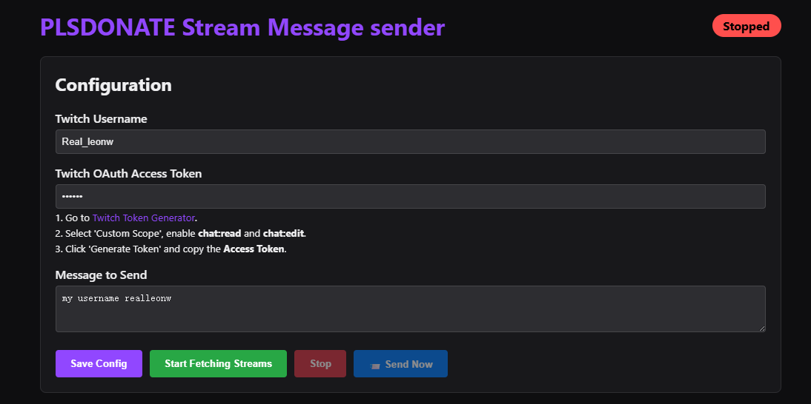

# PLSDONATE Stream Message Sender

A powerful tool to automatically fetch roblox plsdonate streams and send bulk messages to Twitch chats.



## Features
- **Auto-Fetch Streams**: Automatically finds new streams every 15 seconds.
- **Bulk Messaging**: Send messages to all found streamers with a single click.
- **Twitch Integration**: Uses your Twitch account to join chats and send messages.
- **Dark Mode UI**: Clean, dark-themed dashboard for easy management.
- **Live Status**: Real-time logging of joined channels and sent messages.

## Installation

1. Clone the repository or download the source code.
2. Install dependencies:
   ```bash
   npm install
   ```
3. Start the server:
   ```bash
   node server.js
   ```
4. Open your browser and navigate to `http://localhost:3000`.

## Configuration

1. **Twitch Username**: Enter your Twitch username.
2. **Twitch Access Token**:
   - Go to [Twitch Token Generator](https://twitchtokengenerator.com/).
   - Select 'Custom Scope' and enable `chat:read` and `chat:edit`.
   - Generate and copy the **Access Token**.
3. **Message**: Type the message you want to send to streamers.

## Usage

1. Click **Start Fetching Streams** to begin monitoring.
2. The bot will automatically join channels as they are found.
3. Click **📨 Send Now** to broadcast your message to all currently listed streams.
4. Click on any stream card to open the channel in a new tab.

## Disclaimer
This tool is for educational purposes. Please respect Twitch's Terms of Service and do not spam channels.
